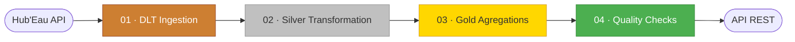
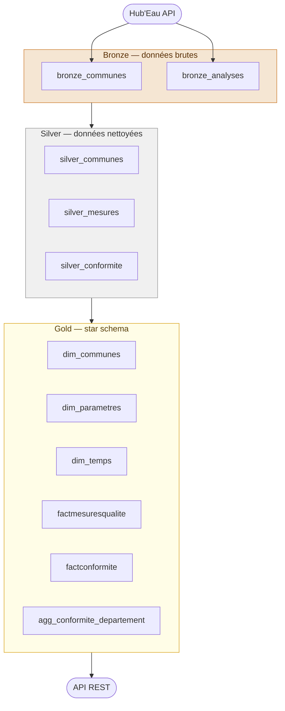
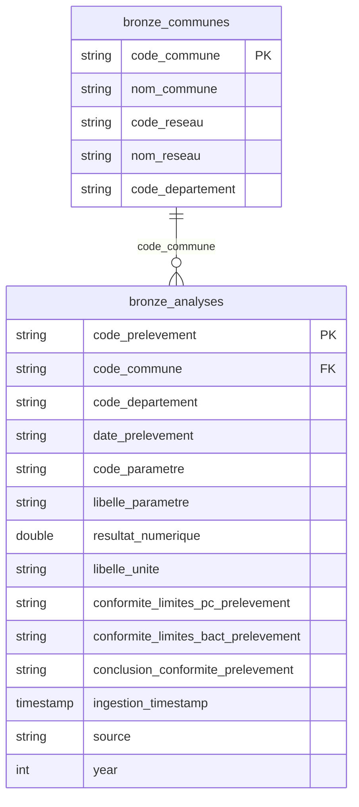
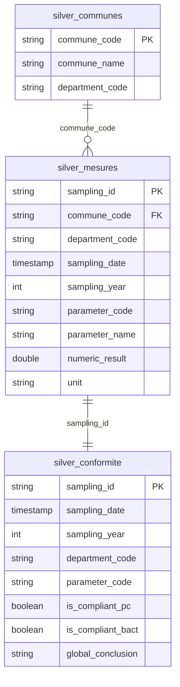
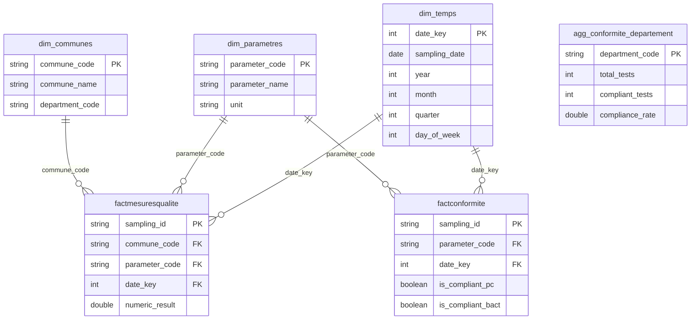

# Water Quality Pipeline — France


Projet d'apprentissage data engineering pour se familiariser avec Azure Databricks, Delta Lake et l'écosystème Azure (ADLS Gen2, Terraform). Le pipeline ingère les données publiques de qualité de l'eau potable en France depuis l'[API Hub'Eau](https://hubeau.eaufrance.fr/page/api-qualite-eau-potable), les transforme selon une architecture Medallion **Bronze → Silver → Gold**, et les expose via une API REST FastAPI sans compute Databricks.

---

## Reproduire le projet

### Prérequis

- Python 3.13+ avec [uv](https://github.com/astral-sh/uv)
- Azure CLI (`az login`)
- Terraform
- Workspace Databricks avec secret scope `azure-credentials` :
  - `storage-account-name`
  - `datalake-access-key`

### 1. Dépendances

```bash
uv sync
cp .env.example .env
```

### 2. Infrastructure Azure

```bash
invoke get-subscription   # Récupère l'ID de subscription → .env
invoke tf-init            # Initialise Terraform
invoke tf-plan            # Crée le plan
invoke tf-apply           # Déploie ADLS Gen2 + Databricks workspace
invoke env-save           # Sauvegarde tous les outputs dans .env
```

> `invoke env-save` remplit automatiquement `DATALAKE_NAME`, `DATALAKE_ACCESS_KEY`, `DATABRICKS_WORKSPACE_URL` et `RESOURCE_GROUP_NAME`.
> Seul `DATABRICKS_TOKEN` est à renseigner manuellement (Databricks > User Settings > Access Tokens).

Autres commandes :

```bash
invoke infra-status       # État de l'infrastructure locale
invoke tf-output          # Outputs Terraform (URLs, noms)
invoke clean-files        # Nettoie les fichiers temporaires
invoke azure-destroy      # Détruit toutes les ressources Azure ⚠️
```

### 3. Notebooks Databricks

Copier les notebooks dans le workspace Databricks et les exécuter dans l'ordre :

| # | Notebook | Rôle |
|---|----------|------|
| 1 | `01_DLT_Ingestion_Qualite_Eau.py` | Ingestion incrémentale depuis Hub'Eau API → Bronze |
| 2 | `02_Silver_Transformation.py` | Nettoyage, standardisation, partitionnement → Silver |
| 3 | `03_Gold_Agregations.py` | Star schema + KPIs par département → Gold |
| 4 | `04_Quality_Checks.py` | Contrôles qualité Spark natif |

### 4. Orchestration (optionnel)

Créer le workflow Databricks `Pipeline_Qualite_Eau_Complet` (schedule quotidien 2h00 Paris) :

```bash
# DATABRICKS_TOKEN et DATABRICKS_NOTEBOOKS_PATH doivent être dans .env
python scripts/create_workflow.py            # Crée le job (pausé par défaut)
python scripts/create_workflow.py --dry-run  # Affiche la config sans créer
```

### 5. API REST (optionnel)

Expose les tables Gold directement depuis ADLS, sans compute Databricks :

```bash
python scripts/api_qualite_eau.py
# Documentation interactive : http://localhost:8000/docs
```

| Endpoint | Description |
|----------|-------------|
| `GET /conformite/departements` | Taux de conformité par département |
| `GET /conformite/departements/{code}` | Détail d'un département |
| `GET /departements/top?order=best\|worst` | Top 10 meilleurs/pires départements |
| `GET /communes?department_code={code}` | Communes filtrables par département |
| `GET /parametres` | Paramètres analysés (nitrates, pH, bactéries…) |
| `GET /mesures/stats` | Statistiques globales des mesures |
| `GET /conformite/stats` | Taux de conformité global PC + bactériologique |

---

## Architecture

### Pipeline de traitement



### Couches de données



---

## Schéma des données

### Bronze — données brutes Hub'Eau



### Silver — données nettoyées et standardisées



> Partitionnement Delta : `silver_mesures` et `silver_conformite` sont partitionnées par `sampling_year` / `department_code`.

### Gold — star schema analytique


