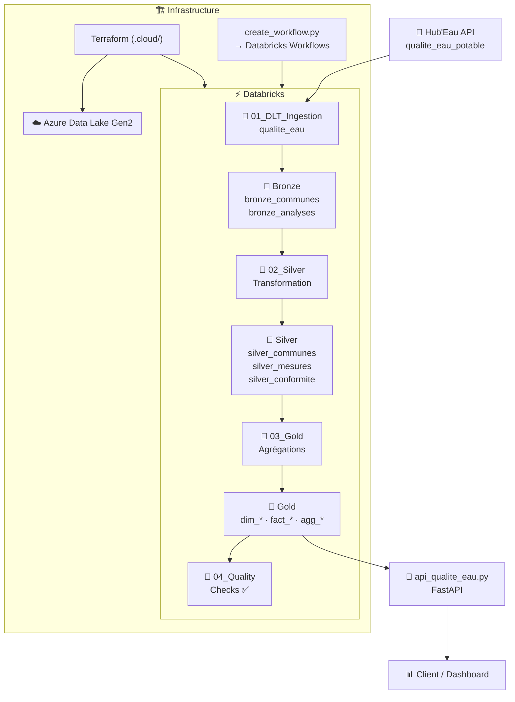
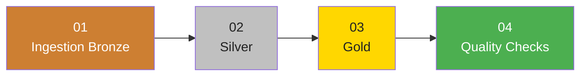

# Water Quality Pipeline — France

Pipeline de données Azure pour l'analyse de la qualité de l'eau potable en France, basé sur l'API Hub'Eau (data.gouv.fr).

## Architecture



## Pipeline Databricks



Orchestré par `Pipeline_Qualite_Eau_Complet` (Databricks Workflows, schedule quotidien 2h00 Europe/Paris).

## Tables produites

| Couche | Table | Description |
|--------|-------|-------------|
| 🥉 Bronze | `bronze_communes` | Communes et réseaux de distribution (Hub'Eau) |
| 🥉 Bronze | `bronze_analyses` | Analyses brutes de qualité (Hub'Eau) |
| 🥈 Silver | `silver_communes` | Communes standardisées + `department_code` |
| 🥈 Silver | `silver_mesures` | Mesures nettoyées — partitionné par année/département |
| 🥈 Silver | `silver_conformite` | Conformité par prélèvement — partitionné par année/département |
| 🥇 Gold | `dim_communes` | Dimension géographique |
| 🥇 Gold | `dim_parametres` | Dimension paramètres analysés |
| 🥇 Gold | `dim_temps` | Dimension temporelle |
| 🥇 Gold | `factmesuresqualite` | Fait mesures |
| 🥇 Gold | `factconformite` | Fait conformité (PC + bactériologique) |
| 🥇 Gold | `agg_conformite_departement` | KPI taux de conformité par département |

## Prérequis

- Python 3.13+ avec [uv](https://github.com/astral-sh/uv)
- Azure CLI (`az login`)
- Terraform
- Workspace Databricks avec secret scope `azure-credentials` :
  - `storage-account-name`
  - `datalake-access-key`

## Déploiement de l'infrastructure

L'infrastructure Azure (ADLS Gen2 + Databricks) est gérée par Terraform dans `.cloud/`.

```bash
uv sync

invoke get-subscription   # Récupère l'ID de subscription Azure → .env
invoke tf-init            # Initialise Terraform
invoke tf-plan            # Crée le plan
invoke tf-apply           # Déploie (ADLS Gen2 + Databricks workspace)
invoke env-save           # Sauvegarde les outputs dans .env
```

Autres commandes :

```bash
invoke infra-status       # État de l'infrastructure locale
invoke tf-output          # Outputs Terraform (URLs, noms...)
invoke clean-files        # Nettoie les fichiers temporaires
invoke azure-destroy      # Détruit toutes les ressources Azure ⚠️
```

## Notebooks Databricks

Copier les 4 notebooks dans le workspace Databricks et les exécuter dans l'ordre :

| # | Notebook | Description |
|---|----------|-------------|
| 1 | `01_DLT_Ingestion_Qualite_Eau.py` | Ingestion Bronze via Hub'Eau API |
| 2 | `02_Silver_Transformation.py` | Nettoyage, standardisation, partitionnement |
| 3 | `03_Gold_Agregations.py` | Star schema + KPIs par département |
| 4 | `04_Quality_Checks.py` | Contrôles qualité Spark natif |

## Orchestration

Créer le workflow Databricks `Pipeline_Qualite_Eau_Complet` automatiquement :

```bash
# Ajouter dans .env :
# DATABRICKS_TOKEN=<personal access token>
# DATABRICKS_NOTEBOOKS_PATH=/Repos/main/WTR_QLT/notebooks

python scripts/create_workflow.py            # Crée le job
python scripts/create_workflow.py --dry-run  # Affiche la config sans créer
```

Le job est créé avec schedule **pausé par défaut** (activer dans Databricks > Workflows).

## API REST

Expose les tables Gold directement depuis ADLS (aucun compute Databricks requis) :

```bash
# .env doit contenir DATALAKE_NAME et DATALAKE_ACCESS_KEY
python scripts/api_qualite_eau.py
```

Documentation interactive : [http://localhost:8000/docs](http://localhost:8000/docs)

| Endpoint | Description |
|----------|-------------|
| `GET /` | Health check |
| `GET /conformite/departements` | Taux de conformité par département |
| `GET /conformite/departements/{code}` | Détail d'un département |
| `GET /departements/top?order=best\|worst` | Top 10 meilleurs/pires départements |
| `GET /communes?department_code={code}` | Communes (filtrables par département) |
| `GET /parametres` | Paramètres analysés (nitrates, pH, bactéries...) |
| `GET /mesures/stats` | Statistiques globales des mesures |
| `GET /conformite/stats` | Taux de conformité global PC + bactériologique |

## Source des données

[Hub'Eau — Qualité de l'eau potable](https://hubeau.eaufrance.fr/page/api-qualite-eau-potable)

- Communes/réseaux : `GET /v1/qualite_eau_potable/communes_udi`
- Analyses : `GET /v1/qualite_eau_potable/resultats_dis`
